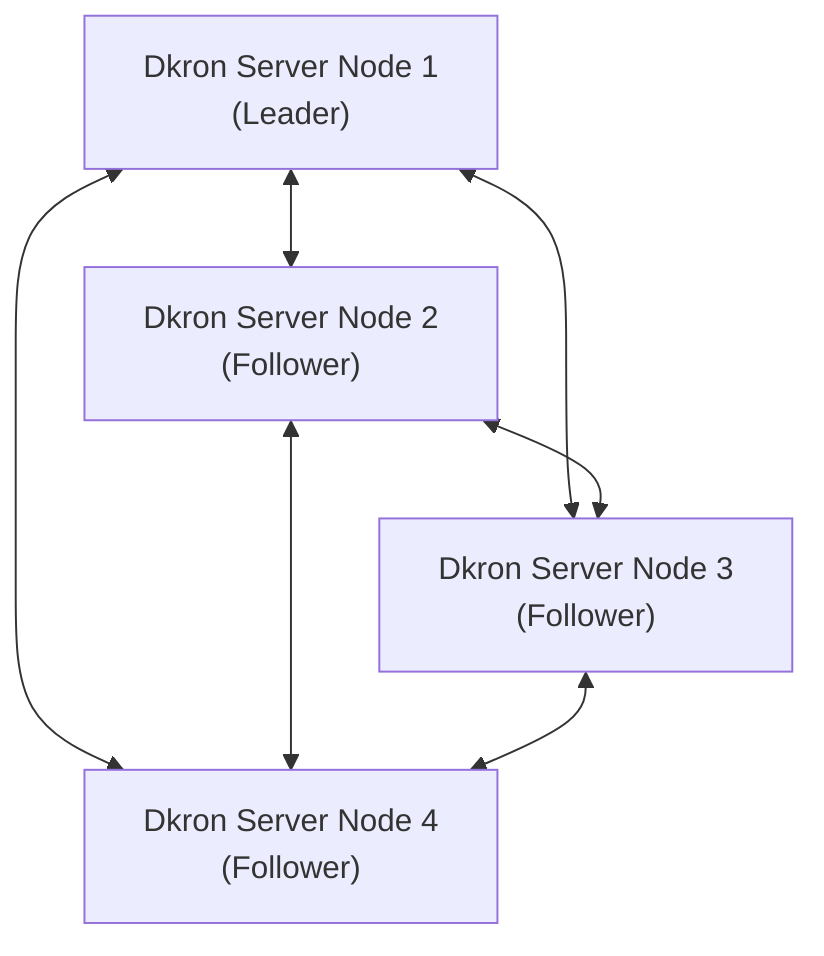
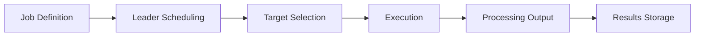
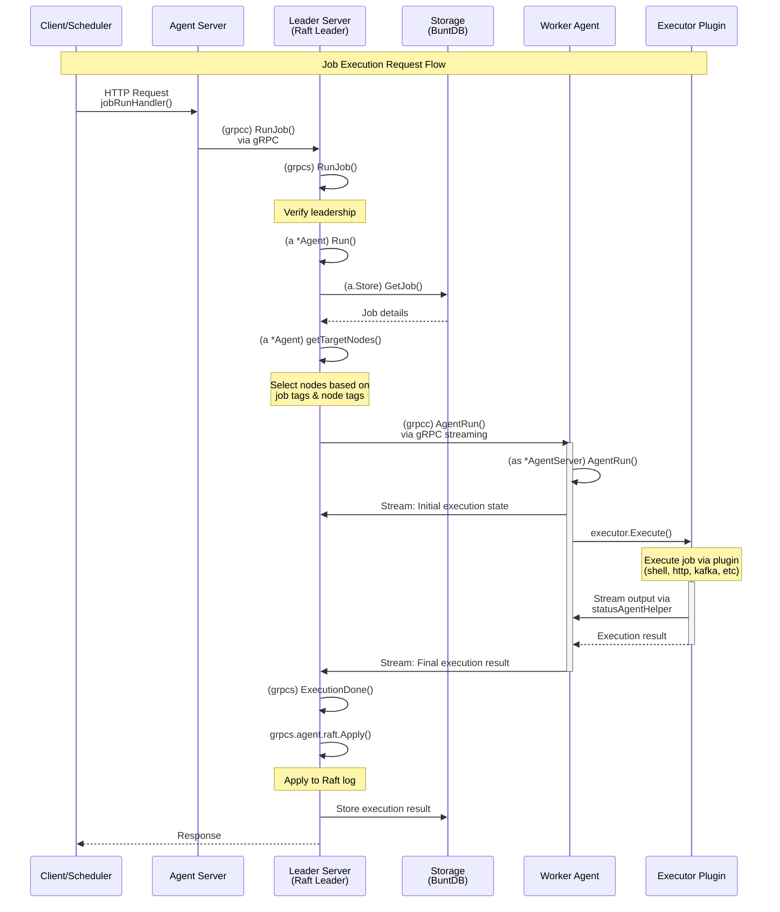

# Architecture

This document provides a comprehensive overview of Dkron's architecture, internal components, and how they work together to provide a distributed, fault-tolerant job scheduling system.

## System Architecture

Dkron utilizes a server-agent architecture where multiple agents can form a cluster for high availability. Here's a high-level overview of how Dkron works:



## Key Components

Dkron's architecture consists of several key components:

1. **Server Nodes**: Nodes running in server mode (with `--server` flag) that participate in leader election and can schedule jobs.

2. **Leader Node**: One server node is elected as leader and is responsible for:
   - Scheduling jobs
   - Assigning job executions to target nodes
   - Maintaining the cluster state

3. **Follower Nodes**: Server nodes that are not the leader. They:
   - Can execute jobs when selected as targets
   - Are ready to become the leader if the current leader fails
   - Maintain a replicated log of all operations

4. **Embedded Data Store**: Dkron uses dual embedded databases:
   - **BuntDB** for application data (job definitions, execution history)
   - **BoltDB** for Raft consensus log (operation replication)

5. **Serf Layer**: Handles cluster membership, failure detection, and messaging between nodes using the gossip protocol.

6. **HTTP API and Web UI**: Provides a RESTful API and web interface for job management.

7. **Executors**: Plugins that handle the actual execution of job commands (shell, HTTP, etc.).

8. **Processors**: Plugins that process the output of job executions (log, file, email, etc.).

## Dkron Scheduling Flow

Here's how job scheduling works in Dkron:



1. **Job Definition**: Users define jobs with scheduling parameters (cron expression), execution options, and target node tags.
2. **Leader Scheduling**: The leader node tracks job schedules and triggers executions at the appropriate times.
3. **Target Selection**: The leader selects target nodes for job execution based on tags and execution options.
4. **Execution**: Target nodes run the job using the specified executor.
5. **Processing Output**: Job output is processed by configured processors.
6. **Results Storage**: Execution results are stored in the distributed data store.

## Job Execution Flow

This diagram illustrates the detailed function call flow when a job is executed in Dkron. It shows the interaction between three main components: the Agent Server (which receives requests), the Leader Server (which orchestrates scheduling), and the Worker Agent (which executes jobs).



## Component Details

### Agent Server

- Entry point for HTTP/gRPC requests
- Routes job execution requests to the leader
- Can forward requests if not the leader

### Leader Server (Raft Leader)

- Elected via Raft consensus protocol
- Orchestrates all job scheduling via the `Scheduler`
- Selects target nodes based on job tags
- Coordinates execution across worker nodes
- Applies state changes to Raft log for consistency
- Stores execution results in BuntDB

### Worker Agent

- Executes jobs assigned by the leader
- Streams execution progress back to leader in real-time
- Can be any node in the cluster (including the leader)
- Uses executor plugins for actual job execution

### Storage Layer

- **BuntDB**: Embedded key-value store for application data (jobs, executions)
- **BoltDB**: Raft log storage for consensus and replication
- Application data is replicated across all server nodes via Raft
- Fast, embedded storage with no external dependencies

### Executor Plugins

- Pluggable execution backends (shell, HTTP, Kafka, NATS, etc.)
- Implement the actual job execution logic
- Stream output back to the worker agent during execution

### Communication Protocols

- **HTTP/REST API** for external clients
- **gRPC** with bidirectional streaming for inter-node communication
- **Serf** for cluster membership and failure detection
- **Raft** for consensus and state replication

## Leadership and Fault Tolerance

Dkron uses a leader-follower model for high availability:

### Leader Responsibilities

- Monitors leadership status through `monitorLeadership()` 
- When elected, calls `establishLeadership()` to initialize duties
- Starts the `Scheduler` to begin scheduling jobs
- Reconciles cluster members via Serf

### Fault Tolerance

- If the leader fails, Raft automatically elects a new leader from follower nodes
- The new leader takes over scheduling without job loss
- Running jobs continue to completion on their worker nodes
- Serf detects the failure and updates cluster membership
- State is preserved through Raft's replicated log

## Consensus and Replication

Dkron uses the **Raft consensus algorithm** (via HashiCorp Raft library) to ensure data consistency across the cluster:

### How Raft Works in Dkron

1. **Leader Election**: Nodes vote to elect a leader. The leader handles all writes.
2. **Log Replication**: The leader replicates all state changes to follower nodes.
3. **Commitment**: Changes are committed only when a majority of nodes have replicated them.
4. **Safety**: Once committed, changes are durable and will survive failures.

### What Gets Replicated

- Job definitions (create, update, delete)
- Job execution results
- Configuration changes
- System state

### Quorum Requirements

- Minimum 3 server nodes recommended for production (allows 1 failure)
- 5 server nodes allow 2 failures
- Quorum = (N/2) + 1 where N is the number of servers

## Cluster Membership with Serf

**Serf** provides cluster membership and failure detection through a gossip protocol:

### Serf Responsibilities

- **Membership**: Track which nodes are part of the cluster
- **Failure Detection**: Quickly detect when nodes fail or become unreachable
- **Event Propagation**: Broadcast custom events across the cluster
- **Node Metadata**: Share node information (tags, roles, etc.)

### Gossip Protocol Benefits

- Scales to thousands of nodes efficiently
- Eventually consistent membership information
- Low network overhead
- Fast failure detection (typically within seconds)

## Data Storage

### BuntDB (Application Data)

Dkron uses BuntDB as the primary application data store:

- **Key-Value Store**: Simple, fast embedded database
- **ACID Transactions**: Ensures data consistency
- **Indexes**: Fast lookups for jobs and executions
- **Storage Limits**: Keeps last 100 executions per job
- **File-Based**: Data stored in a single file (`dkron.db`)

### BoltDB (Raft Log)

Raft operations are stored in BoltDB:

- **Append-Only Log**: Records all state changes
- **Snapshots**: Periodic snapshots to reduce log size
- **Replication**: Log entries are replicated to all servers
- **Recovery**: Allows nodes to catch up after downtime

## Plugin System

Dkron uses **HashiCorp's go-plugin** framework for a flexible plugin architecture:

### Plugin Types

1. **Executors**: Define how jobs are executed
   - Built-in: shell, http, grpc, kafka, nats, rabbitmq, gcppubsub
   - Custom: Users can write their own executors

2. **Processors**: Define how job output is processed
   - Built-in: log, files, syslog, fluent
   - Custom: Users can write their own processors

### Plugin Communication

- Plugins run as separate processes
- Communication via gRPC
- Language-agnostic (can be written in any language with gRPC support)
- Isolated from main process (plugin crashes don't affect Dkron)

## Network Ports

Default ports used by Dkron:

| Port | Protocol | Purpose |
|------|----------|---------|
| 8080 | HTTP | REST API and Web UI |
| 8946 | TCP/UDP | Serf gossip protocol |
| 8190 | TCP | Raft consensus |
| 6868 | gRPC | Inter-node communication |

## Scalability Considerations

### Horizontal Scaling

- **Server Nodes**: 3-5 servers recommended for most deployments
- **Agent Nodes**: Can scale to hundreds or thousands of nodes
- **Job Distribution**: Use tags to distribute load across agents

### Vertical Scaling

- **Leader Node**: May need more resources as job count increases
- **Memory**: Increases with number of jobs and execution history
- **CPU**: Leader uses CPU for scheduling; agents use CPU for execution

### Performance Limits

- **Jobs**: Can handle thousands of job definitions
- **Execution Frequency**: Avoid sub-second schedules for many jobs
- **Cluster Size**: Tested with hundreds of nodes (agent nodes)
- **Concurrent Executions**: Limited by agent resources, not Dkron itself

## Security Architecture

### Network Security

- TLS support for HTTP API
- Encryption for Serf gossip traffic
- Raft communication can be secured with TLS

### Access Control

- Basic authentication for HTTP API
- ACL system available in Pro version
- API token support

### Data Security

- Encryption at rest (optional, filesystem-level)
- Encryption in transit (TLS)
- Secret management through environment variables or external systems

## High Availability Setup

Recommended HA configuration:

```
┌─────────────────────────────────────────┐
│         Load Balancer (Optional)        │
└─────────────────────────────────────────┘
           │              │              │
    ┌──────┴───┐   ┌─────┴────┐   ┌─────┴────┐
    │ Server 1 │   │ Server 2 │   │ Server 3 │
    │ (Leader) │   │(Follower)│   │(Follower)│
    └──────────┘   └──────────┘   └──────────┘
         │              │              │
    ┌────┴──────────────┴──────────────┴────┐
    │         Serf Gossip Network            │
    └─────────────────────────────────────────┘
         │              │              │
    ┌────┴───┐   ┌─────┴────┐   ┌─────┴────┐
    │Agent 1 │   │ Agent 2  │   │ Agent 3  │
    └────────┘   └──────────┘   └──────────┘
```

### Best Practices

1. Deploy servers across multiple availability zones
2. Use odd number of servers (3 or 5)
3. Monitor leader election events
4. Set up proper backup procedures
5. Use health checks and alerting
6. Plan for disaster recovery

## Design Philosophy

Dkron is designed to solve one problem well: executing commands at given intervals. Following the Unix philosophy of doing one thing and doing it well (like the battle-tested cron), but with the addition of being designed for the cloud era, removing single points of failure in environments where scheduled jobs need to be run across multiple servers.

### Design Principles

- **Simplicity**: Easy to deploy and operate
- **Reliability**: No single points of failure
- **Scalability**: Handle thousands of nodes and jobs
- **Observability**: Built-in metrics and logging
- **Extensibility**: Plugin system for custom functionality
