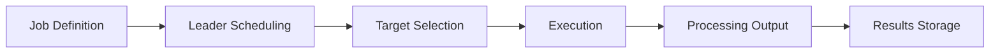
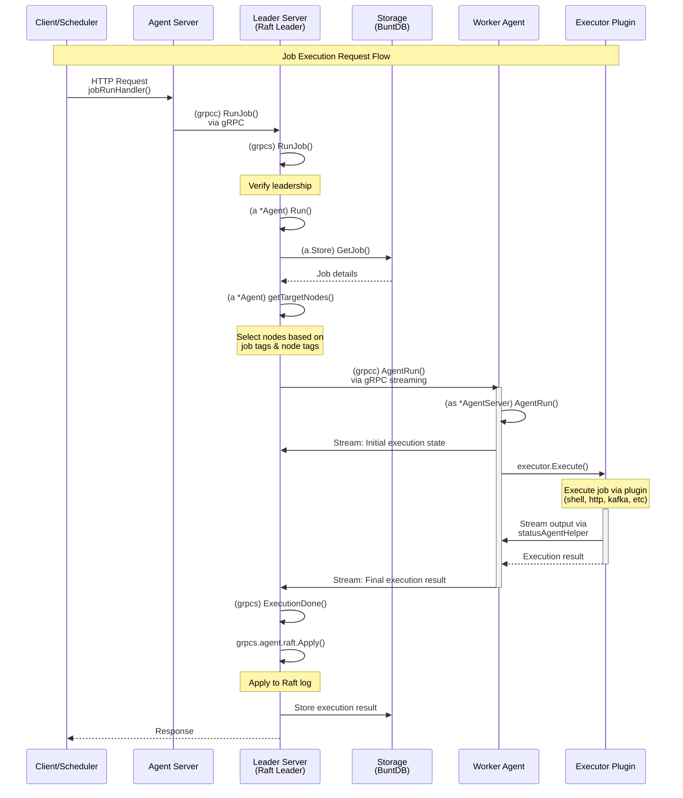

# Intro

## Dkron - Distributed, fault tolerant job scheduling system

Welcome to the Dkron documentation! This is the reference guide on how to use Dkron. If you want a getting started guide refer to the [getting started guide](/docs/basics/getting-started).

## What is Dkron

Dkron is a distributed system to run scheduled jobs against a server or a group of servers of any size. One of the machines is the leader and the others will be followers. If the leader fails or becomes unreachable, any other one will take over and reschedule all jobs to keep the system healthy.

In case the old leader becomes alive again, it'll become a follower.

Dkron is a distributed cron drop-in replacement, easy to setup and fault tolerant with focus in:

- Easy: Easy to use with a great UI
- Reliable: Completely fault tolerant
- Highly scalable: Able to handle high volumes of scheduled jobs and thousands of nodes

Dkron is written in Go and leverages the power of distributed key value stores and [Serf](https://www.serfdom.io/) for providing fault tolerance, reliability and scalability while remaining simple and easily installable.

Dkron is inspired by the google whitepaper [Reliable Cron across the Planet](https://queue.acm.org/detail.cfm?id=2745840)

Dkron runs on Linux, OSX and Windows. It can be used to run scheduled commands on a server cluster using any combination of servers for each job. It has no single points of failure due to the use of the fault tolerant distributed databases and can work at large scale thanks to the efficient and lightweight gossip protocol.

Dkron uses the efficient and lightweight [gossip protocol](https://www.serfdom.io/docs/internals/gossip.html) underneath to communicate with nodes. Failure notification and task handling are run efficiently across an entire cluster of any size.

## System Architecture

Dkron utilizes a server-agent architecture where multiple agents can form a cluster for high availability. Here's a high-level overview of how Dkron works:

```mermaid
flowchart TD
    Node1[Dkron Server Node 1\n(Leader)] <--> Node2[Dkron Server Node 2\n(Follower)]
    Node1 <--> Node3[Dkron Server Node 3\n(Follower)]
    Node1 <--> Node4[Dkron Server Node 4\n(Follower)]
    Node2 <--> Node3
    Node2 <--> Node4
    Node3 <--> Node4
```

### Key Components

Dkron's architecture consists of several key components:

1. **Server Nodes**: Nodes running in server mode (with `--server` flag) that participate in leader election and can schedule jobs.

2. **Leader Node**: One server node is elected as leader and is responsible for:
   - Scheduling jobs
   - Assigning job executions to target nodes
   - Maintaining the cluster state

3. **Follower Nodes**: Server nodes that are not the leader. They:
   - Can execute jobs when selected as targets
   - Are ready to become the leader if the current leader fails
   - Maintain a replicated log of all operations

4. **Embedded Data Store**: Dkron uses an embedded BuntDB database to store:
   - Job definitions
   - Execution history
   
   And a separate BoltDB instance for:
   - Raft consensus log
   - Cluster state

5. **Serf Layer**: Handles cluster membership, failure detection, and messaging between nodes using the gossip protocol.

6. **HTTP API and Web UI**: Provides a RESTful API and web interface for job management.

7. **Executors**: Plugins that handle the actual execution of job commands (shell, HTTP, etc.).

8. **Processors**: Plugins that process the output of job executions (log, file, email, etc.).

## Dkron Scheduling Flow

Here's how job scheduling works in Dkron:



1. **Job Definition**: Users define jobs with scheduling parameters (cron expression), execution options, and target node tags.
2. **Leader Scheduling**: The leader node tracks job schedules and triggers executions at the appropriate times.
3. **Target Selection**: The leader selects target nodes for job execution based on tags and execution options.
4. **Execution**: Target nodes run the job using the specified executor.
5. **Processing Output**: Job output is processed by configured processors.
6. **Results Storage**: Execution results are stored in the distributed data store.

## Architecture: Job Execution Flow

This diagram illustrates the detailed function call flow when a job is executed in Dkron. It shows the interaction between three main components: the Agent Server (which receives requests), the Leader Server (which orchestrates scheduling), and the Worker Agent (which executes jobs).



### Key Architecture Components

**Agent Server**
- Entry point for HTTP/gRPC requests
- Routes job execution requests to the leader
- Can forward requests if not the leader

**Leader Server (Raft Leader)**
- Elected via Raft consensus protocol
- Orchestrates all job scheduling via the `Scheduler`
- Selects target nodes based on job tags
- Coordinates execution across worker nodes
- Applies state changes to Raft log for consistency
- Stores execution results in BuntDB

**Worker Agent**
- Executes jobs assigned by the leader
- Streams execution progress back to leader in real-time
- Can be any node in the cluster (including the leader)
- Uses executor plugins for actual job execution

**Storage Layer**
- BuntDB embedded key-value store for application data
- BoltDB for Raft consensus log storage
- Stores job definitions and execution history
- Replicated via Raft across all server nodes

**Executor Plugins**
- Pluggable execution backends (shell, HTTP, Kafka, NATS, etc.)
- Implement the actual job execution logic
- Stream output back to the worker agent during execution

**Communication**
- HTTP/REST API for external clients
- gRPC with bidirectional streaming for inter-node communication
- Serf for cluster membership and failure detection
- Raft for consensus and state replication

### Leadership and Fault Tolerance

Dkron uses a leader-follower model for high availability:

**Leader Responsibilities:**
- Monitors leadership status through `monitorLeadership()` 
- When elected, calls `establishLeadership()` to initialize duties
- Starts the `Scheduler` to begin scheduling jobs
- Reconciles cluster members via Serf

**Fault Tolerance:**
- If the leader fails, Raft automatically elects a new leader from follower nodes
- The new leader takes over scheduling without job loss
- Running jobs continue to completion on their worker nodes
- Serf detects the failure and updates cluster membership
- State is preserved through Raft's replicated log

## Key Concepts

### Jobs

Jobs are the core entity in Dkron. A job consists of:

- **Name**: Unique identifier for the job
- **Schedule**: When to run the job (cron expression)
- **Command**: What to run
- **Executor**: How to run the command (shell, HTTP, etc.)
- **Processors**: How to process the output
- **Tags**: Key-value pairs for node selection
- **Concurrency**: Options to control concurrent execution
- **Dependent Jobs**: Jobs that should run after this job completes

### Tags and Node Selection

Dkron uses tags to control which nodes execute specific jobs:

- **Node Tags**: Assigned to nodes during startup (`--tag key=value`)
- **Job Tags**: Specified in job definitions (`"tags": {"role": "web"}`)
- **Tag Matching**: Jobs run on nodes where all job tags match node tags

### Concurrency Options

Dkron provides several options to control job concurrency:

- **Concurrency**: Allow (or disallow) concurrent executions of the same job

### Status Codes and Retries

Jobs can be configured with:

- **Retries**: Number of times to retry a failed execution

### Job Dependencies

Dkron supports job dependencies for complex workflows:

- **Parent-Child Relationships**: Jobs can depend on other jobs
- **Status Checking**: Child jobs run only if parent jobs succeed
- **Chained Execution**: Create multi-step job pipelines

## Web UI


The Dkron web UI provides an easy-to-use interface for:

1. Creating and editing jobs
2. Viewing execution history and logs
3. Monitoring cluster status
4. Running jobs manually
5. Managing job dependencies

## Dkron design

Dkron is designed to solve one problem well, executing commands in given intervals. Following the unix philosophy of doing one thing and doing it well (like the battle-tested cron) but with the given addition of being designed for the cloud era, removing single points of failure in environments where scheduled jobs are needed to be run in multiple servers.
