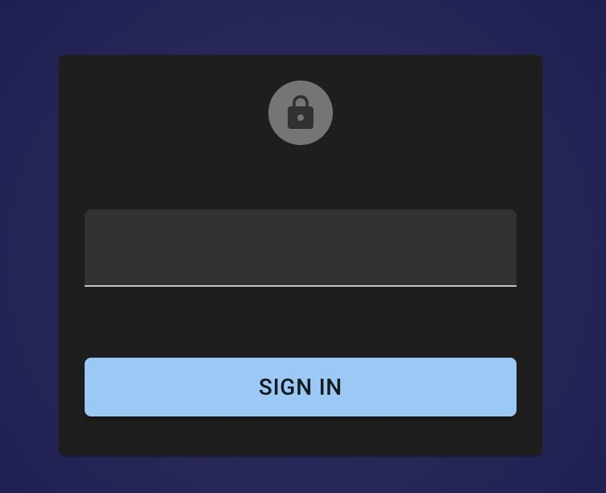

# Access Control Lists

Dkron provides an optional Access Control List (ACL) system which can be used to control access to data and APIs. The ACL is Capability-based, relying on policies to determine which fine grained rules can be applied. Dkron's capability based ACL system is very similar to common ACL systems you are used to.

## ACL System Overview

Dkron's ACL system is implemented with the CNCF [Open Policy Agent](https://www.openpolicyagent.org/) bringing a powerful system to suit your needs.

The ACL system is designed to be easy to use and fast to enforce while providing administrative insight. At the highest level, there are two major components to the ACL system:

* **OPA policy engine.** OPA provices policy decission making [decoupling](https://www.openpolicyagent.org/docs/latest/philosophy/#policy-decoupling) Dkron integrates OPA as a library and provides a default policy rules written in the OPA Policy language that implements a set of enforcing rules on request params to the API that are ready to use for most use cases. You don not need to learn the OPA Policy language to start using Dkron's ACL system, but you can modify the default policy rules to adapt to your use case if you need to. Read more in [OPA Docs](https://www.openpolicyagent.org/docs/latest/)

* **ACL Policies.** Dkron's ACL policies are simple JSON documents that define patterns to allow access to resources. You can find below an example ACL policy that works with the default OPA policy. The ACL JSON structure is not rigid you can adapt it to add new features in combination with the OPA Policy rules.

## Tutorial

### Configuring ACLs

ACLs are not enabled by default and must be enabled. To enable ACLs setup the `acl` section in your config file:

```toml
acl:
  enabled: true
```

Below you can find the most basic example of an ACL policy:

Basic example policy:

```json
{
    "path": {
        "/v1": {
            "capabilities": [
                "read",
            ]
        },
        "/v1/**": {
            "capabilities": [
                "create",
                "read",
                "update",
                "delete",
                "list"
            ]
        }
    }
}'
```

This policy allows any request to the API. As you can see paths uses glob patterns, and capabilities allow operations on resources.

This is a much more granular policy file used as default policy:

```json
{
    "path": {
        "/v1/members": {
            "capabilities": ["read"]
        },
        "/v1/jobs": {
            "capabilities": [
                "list",
                "read",
                "create",
                "update",
                "delete"
            ]
        },
        "/v1/jobs/*": {
            "capabilities": [
                "create",
                "read",
                "update",
                "delete"
            ]
        },            
        "/v1/jobs/*/run": {
            "capabilities": ["create"]
        },
        "/v1/jobs/*/toggle": {
            "capabilities": ["create"]
        },
        "/v1/jobs/*/executions*": {
            "capabilities": ["read"]
        },
        "/v1/jobs/*/executions/*": {
            "capabilities": ["read"]
        },
        "/v1/leader": {
            "capabilities": ["read"]
        },
        "/v1/isleader": {
            "capabilities": ["read"]
        },
        "/v1/leave": {
            "capabilities": ["create"]
        },
        "/v1/restore": {
            "capabilities": ["create"]
        },
        "/v1/busy": {
            "capabilities": ["read"]
        }
    }
}
```

### Setup

The first step after enabling the ACL system and restart is to setup the management token. Run this command to setup the first token that will be the management user:

```
dkron acl bootstrap
```

:::info
Adjust your `--rpc-addr` param if necessary.
:::

After this step you will obtain the details of the management token, something similar to:
```
Accessor ID: fc4a83e5-4657-4c18-92b0-723d7c5f6c1f
Secret: ca40c646-4a86-425d-ae55-b27fdd99d8c4
Name: bootstrap
Type: management
CreateTime: 2024-10-06 11:03:36.605368 +0000 UTC
Policies: default
```

From this point you need to use the "Secret" to communicate with the API of Dkron. If you navigate to you Dkron installation is should show the login page:



Enter the secret and click on "Sign in", after that you should be able to use the UI without limitations.

Check the full documentation on all the available ACL management commands.

### Use the readonly policy

```json
{
    "path": {
        "/v1/members": {
            "capabilities": ["read"]
        },
        "/v1/jobs": {
            "capabilities": [
                "list",
                "read"
            ]
        },
        "/v1/jobs/*": {
            "capabilities": [
                "read"
            ]
        },            
        "/v1/jobs/*/executions*": {
            "capabilities": ["read"]
        },
        "/v1/jobs/*/executions/*": {
            "capabilities": ["read"]
        },
        "/v1/leader": {
            "capabilities": ["read"]
        },
        "/v1/isleader": {
            "capabilities": ["read"]
        },
        "/v1/busy": {
            "capabilities": ["read"]
        }
    }
}
```

Write the readonly file content json to a local file named `readonly.json` and create the readonly policy:

```
dkron acl policy apply --name readonly --rules-file ./readonly.json
```


Create a new token for a readonly user:

```
dkron acl token create --name alice --type client --policy readonly
```

Handle the details to the user.

## Disable ACLs

To diable the ACL system you need to set the configuration value in your dkron configuration file to `false`

```toml
acl:
  enabled: false
```

Restart your system for the change to have effect, after the restart you should be able to access the system without any restriction.
