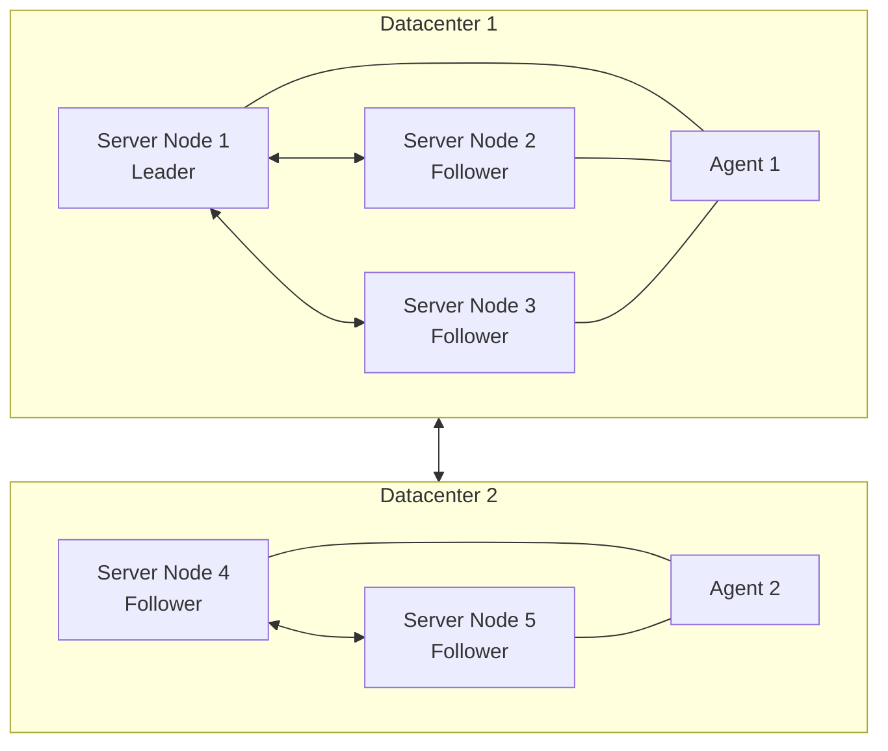

# Clustering

## High Availability Clustering

Dkron is designed to operate as a cluster of multiple nodes for fault tolerance and high availability. This guide explains how to set up and manage a Dkron cluster.



## Cluster Formation

### Bootstrap Methods

Dkron supports several methods for nodes to discover and join each other:

1. **Static List**: Explicitly specify other cluster members
2. **Auto-join**: Automatically discover other nodes
3. **Cloud Auto-join**: Discover nodes in cloud environments

### Basic Cluster Setup

To start a basic 3-node server cluster:

1. **Start the first node**:
   ```
   dkron agent --server --bootstrap-expect=3 --node-name=node1 --bind=10.0.0.1 --advertise=10.0.0.1
   ```

2. **Start additional server nodes**:
   ```
   dkron agent --server --bootstrap-expect=3 --node-name=node2 --bind=10.0.0.2 --advertise=10.0.0.2 --join=10.0.0.1
   dkron agent --server --bootstrap-expect=3 --node-name=node3 --bind=10.0.0.3 --advertise=10.0.0.3 --join=10.0.0.1
   ```

3. **Add agent nodes**:
   ```
   dkron agent --node-name=agent1 --bind=10.0.0.4 --join=10.0.0.1
   ```

### Key Configuration Parameters

| Parameter | Description | Example |
|-----------|-------------|---------|
| `--server` | Run in server mode | `--server` |
| `--bootstrap-expect` | Expected number of servers | `--bootstrap-expect=3` |
| `--node-name` | Unique node identifier | `--node-name=node1` |
| `--bind` | Address to bind network services | `--bind=10.0.0.1` |
| `--advertise` | Address to advertise to cluster | `--advertise=10.0.0.1` |
| `--join` | Address of another node to join | `--join=10.0.0.1` |
| `--retry-join` | Auto-retry joining | `--retry-join=10.0.0.1` |
| `--tag` | Node tag for job targeting | `--tag role=web` |

## Multi-Datacenter Configuration

Dkron can run in HA mode, avoiding SPOFs, this mode provides better scalability and better reliability for users that wants a high level of confidence in the cron jobs they need to run.

Manually bootstrapping a Dkron cluster does not rely on additional tooling, but does require operator participation in the cluster formation process. When bootstrapping, Dkron servers and clients must be started and informed with the address of at least one Dkron server.

As you can tell, this creates a chicken-and-egg problem where one server must first be fully bootstrapped and configured before the remaining servers and clients can join the cluster. This requirement can add additional provisioning time as well as ordered dependencies during provisioning.

First, we bootstrap a single Dkron server and capture its IP address. After we have that nodes IP address, we place this address in the configuration.

1. First bootstrap a node with a configuration like this:

```yaml
# dkron.yml
server: true
bootstrap-expect: 1
```

2. Then stop the bootstrapped server and capture the server IP address.

3. To form a cluster, configure server nodes (including the bootstrapped server) with the address of its peers as in the following example:

```yaml
# dkron.yml
server: true
bootstrap-expect: 3
retry-join:
- 10.19.3.9
- 10.19.4.64
- 10.19.7.215
```

## Deployment Table

Below is a table that shows quorum size and failure tolerance for various
cluster sizes. The recommended deployment is either 3 or 5 servers. A single
server deployment is _**highly**_ discouraged as data loss is inevitable in a
failure scenario.

<table>
  <thead>
    <tr>
      <th>Servers</th>
      <th>Quorum Size</th>
      <th>Failure Tolerance</th>
    </tr>
  </thead>
  <tbody>
    <tr>
      <td>1</td>
      <td>1</td>
      <td>0</td>
    </tr>
    <tr>
      <td>2</td>
      <td>2</td>
      <td>0</td>
    </tr>
    <tr class="warning">
      <td>3</td>
      <td>2</td>
      <td>1</td>
    </tr>
    <tr>
      <td>4</td>
      <td>3</td>
      <td>1</td>
    </tr>
    <tr class="warning">
      <td>5</td>
      <td>3</td>
      <td>2</td>
    </tr>
    <tr>
      <td>6</td>
      <td>4</td>
      <td>2</td>
    </tr>
    <tr>
      <td>7</td>
      <td>4</td>
      <td>3</td>
    </tr>
  </tbody>
</table>

## Fault Tolerance and Recovery

Dkron's distributed architecture is designed to maintain operation even when nodes fail.

### Leader Failure Recovery

When a leader node fails:

1. Remaining server nodes detect the failure through gossip protocol
2. A new leader election is automatically triggered
3. A new leader is elected from the available server nodes
4. The new leader takes over scheduling responsibilities
5. All running jobs continue to operate without interruption

### Quorum Requirements

- A cluster must maintain a quorum (majority) of server nodes to operate
- For a cluster of size N, at least (N/2)+1 nodes must be available
- If quorum is lost, the cluster stops scheduling new jobs until quorum is restored
- Refer to the Deployment Table above for specific quorum sizes and failure tolerance

### Node Rejoining

When a previously failed node rejoins the cluster:

1. The node establishes connection with existing cluster members
2. It synchronizes its state with the current leader
3. If it was previously a leader, it joins as a follower
4. The node becomes available for job execution

### Data Recovery

In case of catastrophic failure:

1. Restore from backup if available
2. Bootstrap a new cluster with at least one server node
3. Import job definitions via API
4. New executions will begin according to schedule

## Cluster Maintenance

Proper maintenance ensures your Dkron cluster remains healthy and performant.

### Adding Nodes

To add a new server node to an existing cluster:

1. Install Dkron on the new server
2. Configure with appropriate server settings
3. Set `--join` parameter to point to existing cluster members
4. Start the Dkron process
5. Verify the node joins successfully via the web UI or API

Adding agent nodes follows the same process but without the `--server` flag.

### Removing Nodes

To gracefully remove a node:

1. For agents: simply stop the Dkron service
2. For server nodes:
   - If possible, demote the node to an agent first
   - Ensure you maintain sufficient servers for quorum
   - Stop the Dkron service

### Upgrading Dkron

For minimal disruption during upgrades:

1. **Rolling Upgrade** (recommended):
   - Upgrade one node at a time
   - Start with agent nodes
   - Then upgrade server nodes, leaving the leader for last
   - Allow state synchronization between each node upgrade

2. **Version Compatibility**:
   - Check release notes for compatibility information
   - Ensure all nodes in a cluster run compatible versions
   - Some upgrades may require special procedures

### Monitoring Cluster Health

Regular health checks should include:

1. **Node Status**: Check that all expected nodes are active
2. **Leadership**: Verify leader election is stable
3. **Job Execution**: Monitor successful job execution rates
4. **Resource Usage**: Track CPU, memory, and disk usage
5. **Log Analysis**: Review logs for errors or warnings

### Backup and Recovery

Implement a regular backup strategy:

1. **Data Store Backup**:
   - Stop Dkron service or use backup-friendly commands
   - Copy the data directory to a secure location
   - Restart the service if stopped

2. **Configuration Backup**:
   - Maintain copies of configuration files
   - Document any custom settings

3. **Job Definition Export**:
   - Use the API to export job definitions
   - Store in version control for tracking changes
