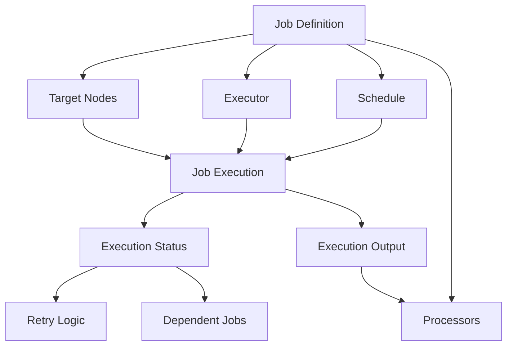
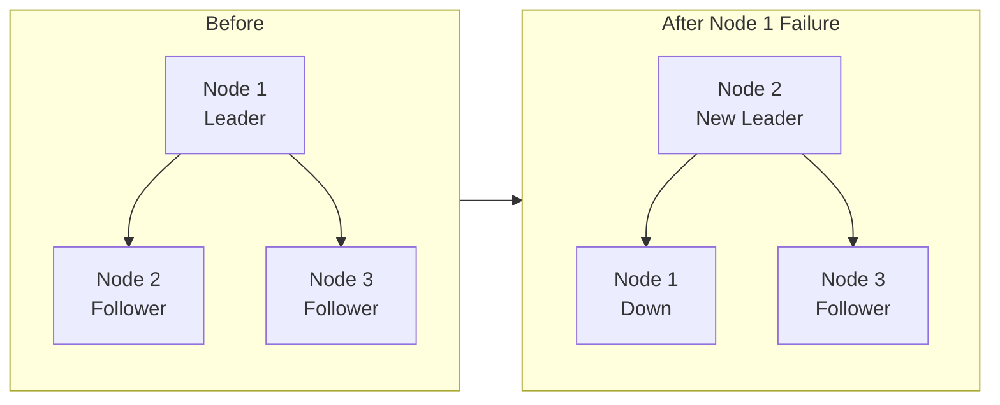
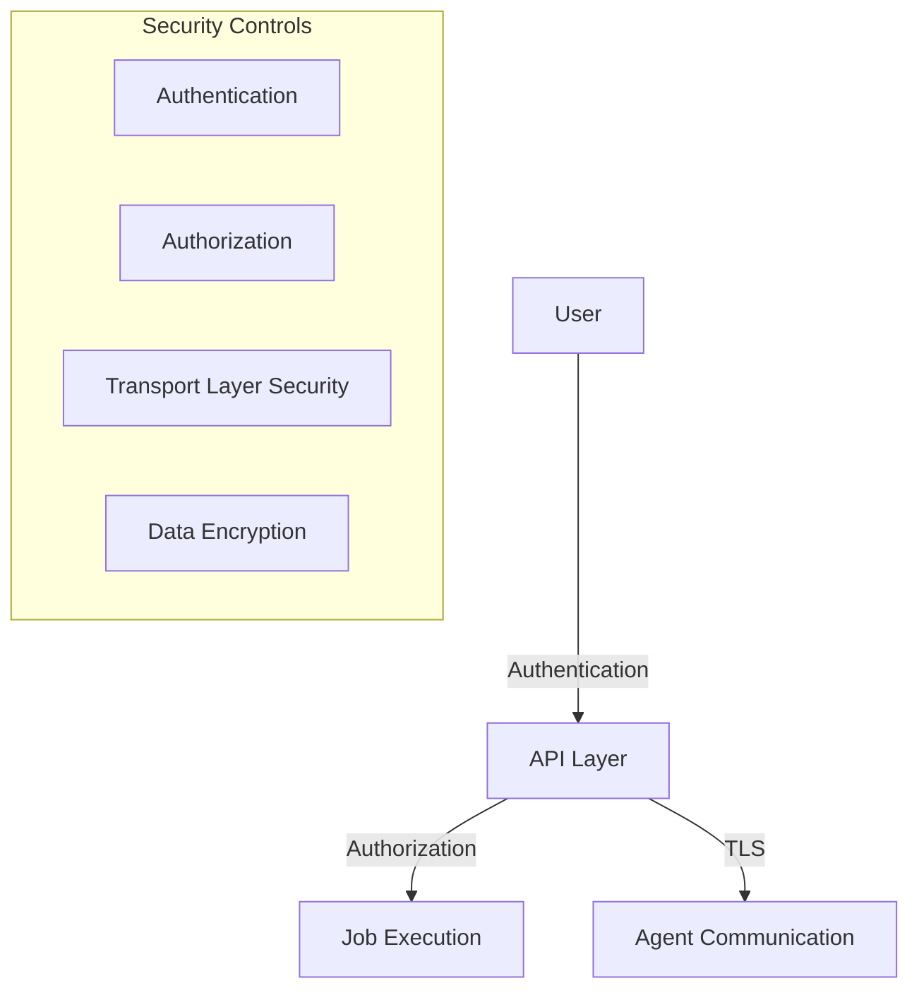

# Concepts

## Core Concepts

Dkron's architecture is based on a few key concepts that are essential to understand:



### Jobs

Jobs are the central entity in Dkron. A job represents a scheduled task with the following properties:

| Property | Description |
|----------|-------------|
| Name | Unique identifier for the job |
| Schedule | When to run (cron expression) |
| Timezone | Reference timezone for the schedule |
| Owner | Owner name for accountability |
| Disabled | Flag to disable the job temporarily |
| Tags | Key-value pairs for node targeting |
| Metadata | Custom user data for the job |
| Concurrency | How to handle overlapping executions |
| Executor | Plugin to execute the job |
| Retry | Configuration for retrying failed jobs |
| Dependent Jobs | Jobs that should run after this one |

### Schedules

Jobs are scheduled using cron expressions. Dkron supports:

- Standard cron expressions (`* * * * *`)
- Predefined schedules (`@hourly`, `@daily`, `@weekly`)
- Interval notation (`@every 1h30m`)
- Custom timezone support

### Executors

Executors are plugins that perform the actual job execution:

- **Shell**: Executes commands on the target node
- **HTTP**: Makes HTTP requests to specified endpoints
- **Kafka**: Produces messages to Kafka topics
- **And more**: Custom executors can be implemented

### Processors

Processors handle the output from job executions:

- **Log**: Records execution output to logs
- **Files**: Saves output to files
- **Custom**: User-implemented processors

### Target Node Selection

Jobs can be targeted to specific nodes using:

- **Tags**: Key-value pairs assigned to nodes
- **Count**: Number of nodes to run the job on
- **Selector**: Logic for choosing nodes

Example tag specification:
```json
"tags": {
  "role": "web",
  "datacenter": "us-east:2"
}
```

### Concurrency Control

Dkron provides several concurrency options:

- **Allow**: Multiple executions can run simultaneously
- **Forbid**: New executions are skipped if one is running
- **Replace**: New executions replace running ones

### Job Dependencies

Jobs can depend on other jobs:

- Parent jobs must complete successfully before dependent jobs run
- Dependencies can form complex workflows
- Status codes determine success/failure

## Advanced Concepts

### Distributed Leadership



Dkron uses a leader-follower model to ensure high availability:

- One server node is elected as leader
- The leader is responsible for scheduling
- If the leader fails, a new leader is automatically elected
- The cluster continues operating without interruption
- When the old leader rejoins, it becomes a follower

### Status Codes

Jobs return status codes that indicate success or failure:

- By default, a zero exit code means success
- You can customize which codes are considered successful
- Status codes determine whether dependent jobs run
- Processors can take different actions based on status codes

### Storage Backend

Dkron uses an embedded BoltDB database for:

- Storing job definitions
- Recording execution history
- Maintaining cluster state
- Storing processor output

For larger deployments, consider these best practices:

- Regular database backups
- Monitoring storage usage
- Setting appropriate retention policies

### Security Considerations



Securing your Dkron deployment:

- **Authentication (Pro feature)**: Protect the API with authentication
- **Authorization (Pro feature)**: Control who can manage jobs
- **TLS (Pro feature)**: Encrypt communication between nodes
- **Network Security**: Use firewalls to restrict access
- **Secrets Management**: Carefully handle credentials in jobs

### Failure Recovery

Dkron provides multiple mechanisms for handling failures:

- **Automatic retries**: Configure jobs to retry on failure
- **Dependent jobs with fallbacks**: Create contingency plans
- **Notifications**: Set up alerting for critical failures
- **Health checks**: Monitor node and cluster status

### Performance Optimization

For optimal performance:

- Distribute jobs across nodes based on resource requirements
- Use appropriate concurrency settings
- Monitor execution times and adjust schedules
- Consider time zone impacts on scheduling
- Optimize command execution with appropriate timeouts
