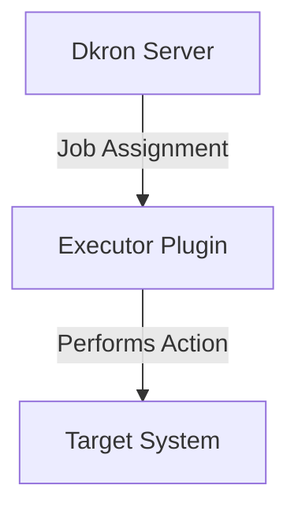

# Executors

Executors are the core plugins that perform actual job tasks in Dkron. They implement different execution strategies and allow Dkron to interact with various systems and services.

## Overview

Executors define how jobs are executed on target nodes. When a job is scheduled to run, Dkron uses the specified executor to perform the actual work. Each executor has its own configuration options and capabilities.

:::info
If you only plan to use the built-in executors, `http` and `shell` you can use the Dkron Light edition that only includes a single binary as the plugins are built-in.
:::

## Built-in Executors

Dkron includes the following built-in executors:

| Executor | Description | Use Case |
|----------|-------------|----------|
| [Shell](/docs/usage/executors/shell) | Executes shell commands on target nodes | Running scripts, system commands |
| [HTTP](/docs/usage/executors/http) | Makes HTTP requests to specified endpoints | API integrations, web hooks |

## Extended Executors (Open Source)

These executors are available as separate plugins in the open source version:

| Executor | Description | Use Case |
|----------|-------------|----------|
| [Kafka](/docs/usage/executors/kafka) | Produces messages to Kafka topics | Event-driven architectures, data pipelines |
| [NATS](/docs/usage/executors/nats) | Publishes messages to NATS servers | Microservices communication, event publishing |
| [RabbitMQ](/docs/usage/executors/rabbitmq) | Sends messages to RabbitMQ exchanges | Message queuing, work distribution |
| [gRPC](/docs/usage/executors/grpc) | Makes calls to gRPC services | Microservices integration, efficient RPC |
| [Google Pub/Sub](/docs/usage/executors/gcp-pubsub) | Publishes messages to Google Pub/Sub topics | Cloud-native event publishing |

## Pro Executors

[Dkron Pro](/pro) includes additional commercially supported executors:

| Executor | Description | Use Case |
|----------|-------------|----------|
| Docker | Runs containers and commands within containers | Isolated execution environments |
| AWS ECS | Runs tasks on Amazon ECS clusters | Serverless job execution in AWS |

## Executor Architecture

Executors follow a plugin architecture in Dkron:

1. The Dkron server schedules a job and assigns it to a node
2. The node loads the specified executor plugin
3. The executor performs its action on the target system
4. Results are returned to Dkron for processing

## Common Executor Configuration Patterns

Most executors share some common configuration concepts:

1. **Timeouts**: Limit how long a job can run before being terminated
2. **Environment Variables**: Pass context to the execution environment
3. **Credentials**: Securely provide authentication information
4. **Retry Logic**: Define behavior when execution fails

## Executor Selection Guide

When choosing an executor for your job, consider:

1. **Target System**: What system or service needs to be interacted with?
2. **Isolation Needs**: Does the job need to run in an isolated environment?
3. **Resource Requirements**: How much CPU/memory is needed?
4. **Security Considerations**: What permissions or credentials are required?

## Custom Executors

Dkron supports custom executors through its plugin system. You can develop your own executors to meet specific requirements not covered by existing plugins.

To develop a custom executor:

1. Implement the `Executor` interface from the Dkron plugin package
2. Follow the [Go plugin system](https://golang.org/pkg/plugin/) requirements
3. Build and deploy your executor to the Dkron plugins directory

See the [plugin development guide](/docs/usage/plugins/develop) for more details.

## Best Practices

1. **Use the Simplest Executor**: Choose the simplest executor that meets your requirements
2. **Set Appropriate Timeouts**: Always configure timeouts to prevent runaway jobs
3. **Validate Output**: Use processors to validate and act on executor output
4. **Monitor Resource Usage**: Pay attention to the resource consumption of jobs
5. **Security First**: Follow the principle of least privilege when configuring executor permissions
